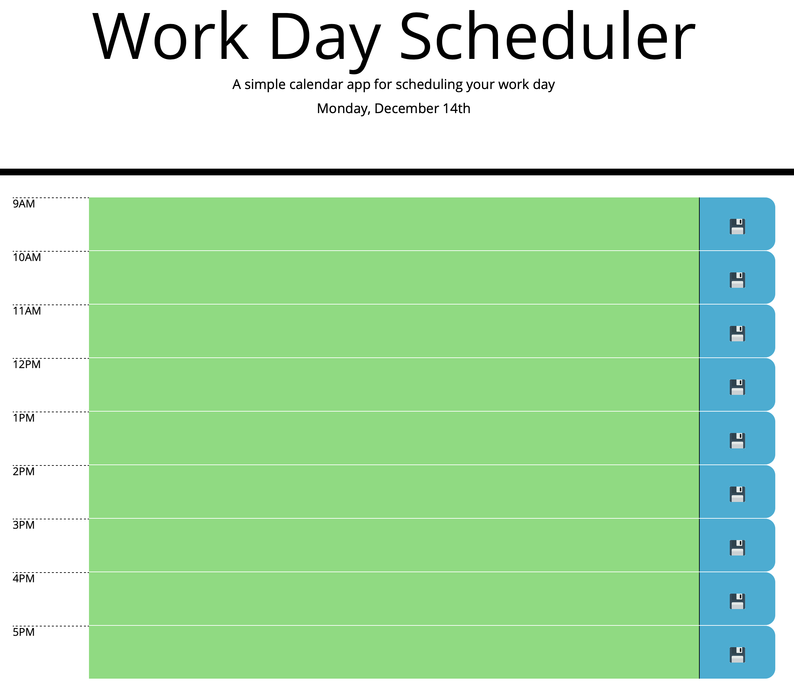
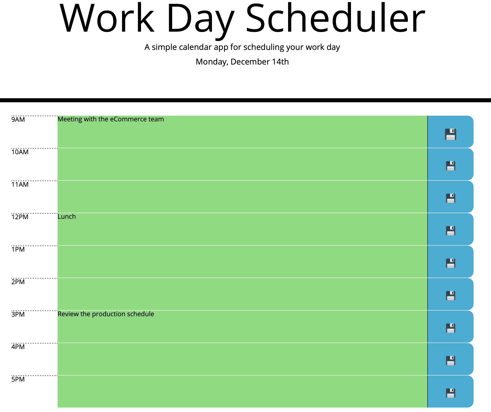

# workDayScheduler
Coding Bootcamp/05-Third-Party-APIs/Homework

## Links:

Github pages link: 'https://avpizarro.github.io/workDayScheduler/'

Github repository link: 'https://github.com/avpizarro/workDayScheduler.git'

## The website helps you plan your day:

Add tasks for each hour of the day:

Your tasks will be stored when pressing the save button:

